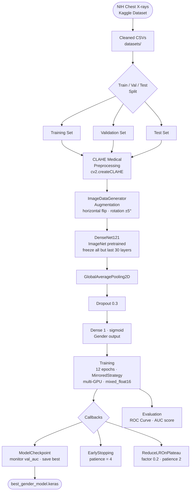
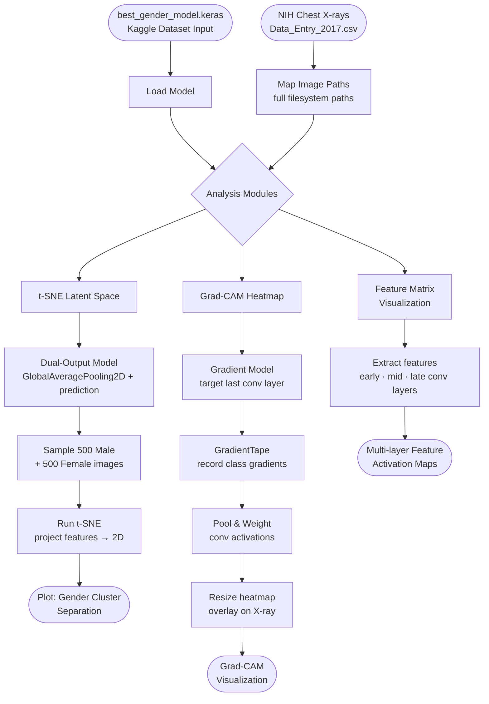
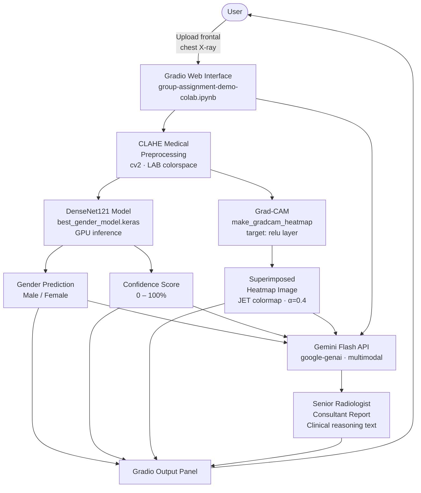

# Gender Identification from Chest X-rays — Group Assignment

## Purpose

This project uses the [NIH Chest X-ray dataset](https://www.kaggle.com/datasets/nih-chest-xrays/data) to train a deep learning model (DenseNet121) that identifies a patient's biological gender from chest X-ray images. The pipeline covers data cleaning, model training, explainability analysis, and an interactive multimodal demo powered by Gemini.

---

## Repository Contents

| File | Platform | Description |
|------|----------|-------------|
| [group-assignment-identify-gender.ipynb](group-assignment-identify-gender.ipynb) | Kaggle | **Primary training notebook** — cleaned datasets, DenseNet121 model |
| [group-assignment-identify-gender-no-data-cleaning.ipynb](group-assignment-identify-gender-no-data-cleaning.ipynb) | Kaggle | Training without data cleaning (baseline comparison) |
| [group-assignment-identify-pathologies.ipynb](group-assignment-identify-pathologies.ipynb) | Kaggle | Experimental notebook for pathology identification |
| [group-assignment-explainable-ai-xai.ipynb](group-assignment-explainable-ai-xai.ipynb) | Kaggle | Explainability and evaluation of the trained gender model |
| [group-assignment-demo-colab.ipynb](group-assignment-demo-colab.ipynb) | Google Colab | Interactive Gradio demo combining the model with Gemini API |
| `datasets/` | — | Preprocessed CSV files (train / validation / test splits) |
| `models/` | — | Saved `.keras` model files produced by training |

---

## Dataset

- **Raw source:** NIH Chest X-rays — https://www.kaggle.com/datasets/nih-chest-xrays/data
- The notebooks use cleaned CSVs stored in `datasets/`. Each CSV contains image file names and metadata (patient gender, age, findings).
- Kaggle dataset mount path (within notebooks): `/kaggle/input/datasets/organizations/nih-chest-xrays/data/`

---

## 1. Training Flow — `group-assignment-identify-gender.ipynb`

### Kaggle Setup (Training)

1. Open a new Kaggle Notebook and name it appropriately (e.g., "Gender Identification Training").
2. Click `+ Add Input` and search for "NIH Chest X-rays", click "+" to attach the dataset to your notebook.
3. Click `Upload` and upload the cleaned CSV files from the `datasets/` folder in this repo, name the dataset title appropriately.
4. Click `File` → `Import Notebook` to import the notebooks from GitHub or upload them directly.
5. Update file paths in the notebook to point to the correct locations of the CSVs (mainly for the variables `train_df`, `valid_df`, `test_df` and `csv_search`).
6. Set the runtime to use a GPU: `Session options` → `Accelerator` → `GPU T4 x2`.
7. Click `Run All` in the notebook, or click `Save Version` → `Save & Run All (Commit)` to run in the background without notebook interaction.
8. Monitor output cells for training progress, or check the `Logs` tab for background execution logs.
9. After training completes, download `best_gender_model.keras` from the notebook output for use in the demo.

> **Note:** Model training takes approximately 3–4 hours on Kaggle's GPU.

---

## 2. Explainability Flow — `group-assignment-explainable-ai-xai.ipynb`

Run in Kaggle after training. Attach the saved model as an additional dataset input.

### Kaggle Setup (XAI)

1. Reuse your Kaggle Notebook environment or create a new one.
2. Attach the NIH Chest X-rays dataset **and** your trained model dataset.
3. Update `MODEL_PATH` at the top of the notebook to your model's Kaggle input path.
4. Run all cells — outputs include t-SNE plots, Grad-CAM overlays, and feature activation maps.

---

## 3. Demo Architecture — `group-assignment-demo-colab.ipynb`

Run in Google Colab. Provides a Gradio web interface combining the trained model with Gemini multimodal reasoning.

**Component summary:**

| Component | Role |
|-----------|------|
| Gradio `gr.Blocks` | Web UI — image upload, results display |
| `medical_preprocessing` | CLAHE contrast enhancement for X-ray images |
| DenseNet121 (`.keras`) | CNN — predicts Female probability (sigmoid output) |
| `make_gradcam_heatmap` | Grad-CAM on `relu` layer for saliency visualization |
| Gemini Flash (`gemini-flash-latest`) | Multimodal LLM — validates prediction with clinical reasoning |

### Google Colab Setup (Demo)

1. Open Google Colab and click `File` → `Open Notebook`, then choose `Upload` to upload the demo notebook.
2. Set up the runtime environment:
   - Click `Runtime` → `Change runtime type`.
   - Under `Hardware accelerator`, select `T4 GPU` and click `Save`.
3. Add Secrets:
   - Click the key icon (🔑) in the left sidebar.
   - Add a new secret named `GEMINI_API_KEY` and paste your Gemini API key as the value. A free-tier key from [Google AI Studio](https://aistudio.google.com/) is sufficient.
   - Enable **Notebook access** for the secret.
4. Upload the trained model file to Colab:
   - Click the folder icon in the left sidebar to open the file explorer.
   - Click the upload icon and select `best_gender_model.keras` from your local machine.
   - The file lands at `/content/best_gender_model.keras` — update `MODEL_PATH` in the notebook if the name differs.
5. Click `Run All` (or `Ctrl+F9`) to execute. The demo loads the model, starts a Gradio server, and prints a public share URL.
6. Open the printed Gradio URL to use the web interface.

---

## Notes and Caveats

- The NIH Chest X-rays dataset contains sensitive medical images — follow all data usage agreements.
- Gender identification from X-rays is an exploratory academic exercise. Report limitations and ethical considerations in any writeup.
- Grad-CAM highlights which pixels influenced the model's decision; verify the model attends to valid biological markers (clavicle, rib cage) rather than artifacts (labels, leads).

